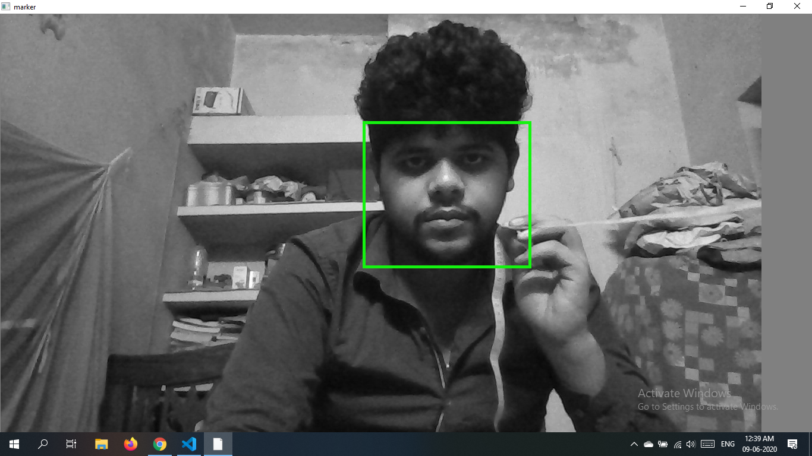
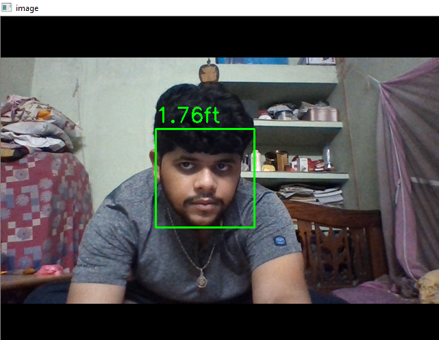

# OBJECTIVE

To detect the distance of people from camera by locating the position of their faces using Triangle Similarity for Object/Marker to Camera Distance.

# TOOLS USED :
* Python

* OpenCV

* Haarcascade_FrontalFace

## Python Libraries :
- numpy
- cv2
- imutils/path
- time

# Installation :
Install OpenCV for Python by the following link - https://pypi.org/project/opencv-python/

Install library for [imutils](https://stackoverflow.com/questions/34161318/how-to-install-imutils-0-2-for-python-in-windows-07) 

Install library for [sys](https://pypi.org/project/syspath/)

After unzipping the folder run the executable distance_to_camera.py python file

# Concept :
In order to determine the distance from our camera to a known object or marker, we are going to utilize triangle similarity.

The triangle similarity goes something like this: Let’s say we have a marker or object with a known width W. We then place this marker some distance D from our camera. We take a picture of our object using our camera and then measure the apparent width in pixels P. This allows us to derive the perceived focal length F of our camera:

F = (P x  D) / W

I continue to move my camera both closer and farther away from the object/marker, I can apply the triangle similarity to determine the distance of the object to the camera:

D’ = (W x F) / P

The test image is converted into gray-scale and face marker is found using haarcascade_frontalface.xml

The known distance of the marker is then used to compute focal length of camera.

### Screenshot of Marker at 2ft

Once the focal length is known and taking into account the average width of a human face our code is ready to detect distance of faces.

# Contribute :

When contributing to this repository, please first discuss the change you wish to make via issue, email, or any other method with the owner of this repository before making a change.

- Email : [Naman Indranil](itscallednamanindranil@gmail.com)

## References
[PyImageSearch](https://www.pyimagesearch.com/)